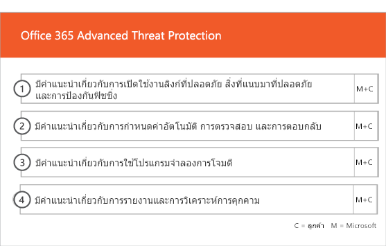

# ขั้นตอนการออนบอร์ดและการโยกย้ายOnboarding and Migration Phases

การเริ่มต้นใช้งาน Office 365 มีสี่ระยะหลัก ได้แก่ เริ่มต้น ประเมิน แก้ไข และเปิดใช้งานOffice 365 onboarding has four primary phases—Initiate, Assess, Remediate, and Enable. คุณสามารถทําตามขั้นตอนเหล่านี้ด้วยขั้นตอนการย้ายข้อมูลทางเลือกดังที่แสดงในรูปต่อไปนี้You can follow these phases with an optional data migration phase as shown in the following figure.
  

  
> [!NOTE]
>สําหรับข้อมูลเกี่ยวกับการปฐมพยาบาลและการย้ายสําหรับรัฐบาลสหรัฐฯของ Office 365 โปรดดูที่[การปฐมพยาบาลและการโยกย้ายสําหรับรัฐบาลสหรัฐฯ ของ Office 365](US-Gov-appendix-onboarding-and-migration.md)For information on onboarding and migration for Office 365 US Government, see [Onboarding and Migration for Office 365 US Government](US-Gov-appendix-onboarding-and-migration.md). 

สําหรับงานโดยละเอียดสําหรับแต่ละเฟส โปรดดูที่[ความรับผิดชอบของ FastTrack](O365-fasttrack-responsibilities.md)และ[ความรับผิดชอบของคุณ](O365-your-responsibilities.md)For detailed tasks for each phase, see [FastTrack Responsibilities](O365-fasttrack-responsibilities.md) and [Your Responsibilities](O365-your-responsibilities.md).
  
## เริ่มต้นขั้นตอนInitiate phase

หลังจากที่คุณซื้อหมายเลขที่เหมาะสมและชนิดของใบอนุญาตให้ทําตามคําแนะนําจากอีเมลยืนยันการซื้อเพื่อเชื่อมโยงสิทธิ์การใช้งานกับผู้เช่าที่มีอยู่หรือผู้เช่าใหม่ของคุณAfter you purchase the appropriate number and types of licenses, follow the guidance from the purchase confirmation email to associate the licenses to your existing or new tenant. 
  
คุณสามารถขอความช่วยเหลือจาก[ศูนย์การจัดการ Microsoft 365](https://go.microsoft.com/fwlink/?linkid=2032704)หรือ[ไซต์ FastTrack](https://go.microsoft.com/fwlink/?linkid=780698)You can get help through the [Microsoft 365 admin center](https://go.microsoft.com/fwlink/?linkid=2032704) or the [FastTrack site](https://go.microsoft.com/fwlink/?linkid=780698). 

เมื่อต้องการขอความช่วยเหลือผ่าน[ศูนย์การจัดการ Microsoft 365](https://go.microsoft.com/fwlink/?linkid=2032704)ผู้ดูแลระบบของคุณจะลงชื่อเข้าใช้ศูนย์การจัดการ แล้วคลิกเครื่องมือ**ต้องการความช่วยเหลือ**To get help through the [Microsoft 365 admin center](https://go.microsoft.com/fwlink/?linkid=2032704), your admin signs into the admin center and then clicks the **Need help?** widget. 

หากต้องการขอความช่วยเหลือผ่านเว็บไซต์[FastTrack](https://go.microsoft.com/fwlink/?linkid=780698):To get help through the [FastTrack site](https://go.microsoft.com/fwlink/?linkid=780698): 
1.    ลงชื่อเข้าใช้เว็บไซต์[FastTrack](https://go.microsoft.com/fwlink/?linkid=780698)Sign in to the [FastTrack site](https://go.microsoft.com/fwlink/?linkid=780698). 
2.    เลือก**ขอรับความช่วยเหลือสําหรับ Microsoft 365**จาก**การดําเนินการด่วน**ที่ด้านบนของหน้า Landing Page ของคุณ หรือโดยการเลือก**ขอรับความช่วยเหลือสําหรับ Microsoft 365**บนการ์ดปรับใช้Select **Request assistance for Microsoft 365** from the **quick actions** on the top of your landing page or by selecting **Request assistance for Microsoft 365** on the deploy card.
3.    ดําเนินการ**ร้องขอความช่วยเหลือสําหรับฟอร์ม Microsoft 365**Complete the **Request Assistance for Microsoft 365** form. 
  
พาร์ทเนอร์ยังสามารถรับความช่วยเหลือผ่านเว็บไซต์[FastTrack](https://go.microsoft.com/fwlink/?linkid=780698)ในนามของลูกค้าPartners can also get help through the [FastTrack site](https://go.microsoft.com/fwlink/?linkid=780698) on behalf of a customer. เมื่อต้องการทําเช่นนั้น:To do so:
1.    ลงชื่อเข้าใช้เว็บไซต์[FastTrack](https://go.microsoft.com/fwlink/?linkid=780698)Sign in to the [FastTrack site](https://go.microsoft.com/fwlink/?linkid=780698). 
2.    เลือก**ลูกค้าของฉัน**Select **My Customers**.
3.    ค้นหาลูกค้าของคุณ หรือเลือกลูกค้าจากรายการลูกค้าของคุณSearch for your customer or select them from your customer list.
4.    เลือก**บริการ**Select **Services**.
5.    ดําเนินการ**ร้องขอความช่วยเหลือสําหรับฟอร์ม Microsoft 365**Complete the **Request Assistance for Microsoft 365** form.

คุณยังสามารถขอความช่วยเหลือจาก FastTrack Center[ได้จากไซต์ FastTrack](https://go.microsoft.com/fwlink/?linkid=780698)ในรายการบริการที่พร้อมใช้งานสําหรับผู้เช่าของคุณYou can also ask for FastTrack Center help from the [FastTrack site](https://go.microsoft.com/fwlink/?linkid=780698) in the list of available services for your tenant. 
    
ในระหว่างขั้นตอนนี้ เราจะหารือเกี่ยวกับกระบวนการการเตรียมพร้อมDuring this phase, we discuss the onboarding process, verify your data, and set up a kickoff meeting. ซึ่งรวมถึงการทํางานกับคุณเพื่อให้เข้าใจถึงวิธีการที่คุณตั้งใจจะใช้บริการและเป้าหมายขององค์กรและแผนงานเพื่อขับเคลื่อนการใช้งานบริการThis includes working with you to understand how you intend to use the service and your organization's goals and plans to drive service usage.
  

  
## ประเมินระยะAssess phase

ผู้จัดการ FastTrack ของคุณดําเนินการวางแผนความสําเร็จแบบโต้ตอบกับคุณและทีมรับเลี้ยงบุตรบุญธรรมของคุณYour FastTrack Manager conducts an interactive success planning call with you and your adoption team. นี้แนะนําให้คุณกับความสามารถของบริการที่มีสิทธิ์ที่คุณซื้อรากฐานที่สําคัญที่คุณต้องการสําหรับความสําเร็จวิธีการสําหรับการใช้ขับรถของบริการและสถานการณ์ที่คุณสามารถใช้เพื่อให้ได้ค่าจากบริการThis introduces you to the capabilities of the eligible services you purchased, the key foundations you need for success, the methodology for driving usage of the service, and scenarios you can use to get value from the services. เราช่วยคุณในการวางแผนความสําเร็จและแสดงความคิดเห็นเกี่ยวกับประเด็นสําคัญ (ตามความจําเป็น)We assist you in success planning and provide feedback on key areas (as needed).
  
ผู้เชี่ยวชาญ FastTrack ทํางานร่วมกับคุณเพื่อประเมินสภาพแวดล้อมของแหล่งที่มาและข้อกําหนดของคุณFastTrack Specialists work with you to assess your source environment and the requirements. เราให้บริการเครื่องมือสําหรับคุณในการรวบรวมข้อมูลเกี่ยวกับสภาพแวดล้อมของคุณและแนะนําคุณผ่านการประเมินความต้องการแบนด์วิดธ์และประเมินอินเทอร์เน็ตเบราว์เซอร์ของคุณ, ระบบปฏิบัติการของลูกค้า, ระบบชื่อโดเมน (DNS), เครือข่าย, โครงสร้างพื้นฐานและระบบเอกลักษณ์เพื่อตรวจสอบว่าการเปลี่ยนแปลงใด ๆ ที่จําเป็นสําหรับการเตรียมความพร้อม.We provide tools for you to gather data about your environment and  guide you through estimating bandwidth requirements and assessing your internet browsers, client operating systems, Domain Name System (DNS), network, infrastructure, and identity system to determine if any changes are required for onboarding. 
  
เราจัดเตรียมแผนการแก้ไขที่นําสภาพแวดล้อมต้นทางของคุณมาสู่ความต้องการขั้นต่ําสําหรับการเริ่มต้นใช้งาน Office 365 สําเร็จ และหากต้องการสําหรับกล่องจดหมายและ/หรือการย้ายข้อมูลที่ประสบความสําเร็จBased on your current setup, we provide a remediation plan that brings your source environment up to the minimum requirements for successful onboarding to Office 365 and, if needed, for successful mailbox and/or data migration. เราให้ชุดของกิจกรรมที่แนะนําเพื่อเพิ่มมูลค่าผู้ใช้และการยอมรับWe provide a set of suggested activities to increase end user value and adoption. เรายังตั้งค่าจุดตรวจที่เหมาะสมสําหรับระยะแก้ไขWe also set up appropriate checkpoint calls for the Remediate phase.
  

  
## ขั้นตอนการแก้ไขRemediate phase

คุณทํางานด้านการแก้ไขตามสภาพแวดล้อมต้นทางของคุณเพื่อให้คุณมีคุณสมบัติตรงตามข้อกําหนดสําหรับการเริ่มต้นใช้งานYou do the remediation tasks based on your source environment so that you meet the requirements for onboarding, adopting, and migrating each service as needed.
  

  
เรายังมีกิจกรรมแนะนําเพื่อเพิ่มมูลค่าผู้ใช้และการยอมรับWe also provide a set of suggested activities to increase end user value and adoption. ก่อนที่จะเริ่มเปิดใช้งานเฟสเราร่วมกันตรวจสอบผลของกิจกรรมการแก้ไขเพื่อให้แน่ใจว่าคุณพร้อมที่จะดําเนินการต่อBefore beginning the Enable phase, we jointly verify the outcomes of the remediation activities to make sure you're ready to proceed. 
  
ในระหว่างขั้นตอนนี้ FastTrack Manager จะทํางานร่วมกับคุณในการวางแผนความสําเร็จ เพื่อชี้แนะคุณเกี่ยวกับทรัพยากรที่เหมาะสมและแนวทางปฏิบัติที่ดีที่สุดเพื่อให้คําแนะนําสําหรับคุณที่จะทําให้บริการพร้อมใช้งานสําหรับองค์กรของคุณและกระตุ้นการใช้งานทั่วทั้งบริการDuring this phase, your FastTrack Manager works with you on success planning, guiding you to the right resources and best practices to provide guidance for you to make the service available to your organization and drive usage across the services.
  
## เปิดใช้งานเฟสEnable phase

เมื่อกิจกรรมการแก้ไขทั้งหมดเสร็จสมบูรณ์When all remediation activities are complete, the focus shifts to configuring the core infrastructure for service consumption, provisioning Office 365, and conducting the activities to drive service adoption. 
  
## หลักCore

การเตรียมพร้อมหลักเกี่ยวข้องกับการจัดเตรียมบริการและการรวมผู้เช่าและเอกลักษณ์Core onboarding involves service provisioning and tenant and identity integration. นอกจากนี้ยังรวมถึงขั้นตอนในการจัดเตรียมพื้นฐานสําหรับบริการการเริ่มต้นใช้งาน เช่น Exchange Online, SharePoint Online และ Skype สําหรับธุรกิจออนไลน์It also includes steps for providing a foundation for onboarding services like Exchange Online, SharePoint Online, and Skype for Business Online. คุณและผู้จัดการ FastTrack ของคุณยังคงมีการวางแผนความสําเร็จการประชุมจุดตรวจสอบเพื่อประเมินความคืบหน้าต่อเป้าหมายของคุณและกําหนดความช่วยเหลือเพิ่มเติมที่คุณต้องการYou and your FastTrack Manager continue to have success planning checkpoint meetings to evaluate progress against your goals and determine what further assistance you need.
  

  

  
> [!NOTE]
> WAP ย่อมาจากพร็อกซีโปรแกรมประยุกต์บนเว็บWAP stands for Web Application Proxy. SSL ย่อมาจากชั้นซ็อกเก็ตการรักษาความปลอดภัยSSL stands for Secure Sockets Layer. SDS ย่อมาจากการซิงค์ข้อมูลของโรงเรียน สําหรับข้อมูลเพิ่มเติมเกี่ยวกับ SDS ให้ดูที่[ยินดีต้อนรับสู่การซิงค์ข้อมูล Microsoft School](https://go.microsoft.com/fwlink/?linkid=871480)SDS stands for School Data Sync. For more information on SDS, see [Welcome to Microsoft School Data Sync](https://go.microsoft.com/fwlink/?linkid=871480). 
  
การปฐมนาสําหรับบริการที่มีสิทธิ์อย่างน้อยหนึ่งบริการสามารถเริ่มต้นได้เมื่อเริ่มต้นหลักเสร็จสิ้นOnboarding for one or more eligible services can begin once core onboarding is finished.
  
## แลกเปลี่ยนแบบออนไลน์Exchange Online

สําหรับการแลกเปลี่ยนแบบออนไลน์เราแนะนําคุณตลอดกระบวนการเพื่อให้องค์กรของคุณพร้อมที่จะใช้อีเมลFor Exchange Online, we guide you through the process to get your organization ready to use email. ขั้นตอนที่แน่นอน ขึ้นอยู่กับสภาพแวดล้อมต้นทางและแผนการย้ายข้อมูลอีเมลของคุณ อาจรวมถึงคําแนะนําสําหรับ:The exact steps, depending on your source environment and your email migration plans, can include providing guidance for:
- การตั้งค่าคุณลักษณะการป้องกันแบบออนไลน์ของ Exchange (EOP) สําหรับโดเมนที่เปิดใช้งานจดหมายทั้งหมดตรวจสอบความถูกต้องใน Office 365Setting up Exchange Online Protection (EOP) features for all mail-enabled domains validated in Office 365.
    > [!NOTE]
    > ระเบียนการแลกเปลี่ยนจดหมาย (MX) ของคุณต้องชี้ไปที่ Office 365Your mail exchange (MX) records must point to Office 365. 
- การตั้งค่าคุณลักษณะการป้องกันภัยคุกคามขั้นสูงของ Office 365 (ATP) ถ้าเป็นส่วนหนึ่งของบริการการสมัครใช้งานของคุณSetting up the Office 365 Advanced Threat Protection (ATP) feature if it's part of your subscription service. สําหรับข้อมูลเพิ่มเติม ให้ดูที่[การป้องกันภัยคุกคามขั้นสูงของ Office 365](#office-365-advanced-threat-protection)For more information, see [Office 365 Advanced Threat Protection](#office-365-advanced-threat-protection).
- การตั้งค่าคุณลักษณะการป้องกันข้อมูลสูญหาย (DLP) สําหรับโดเมนที่เปิดใช้งานจดหมายทั้งหมดได้รับการตรวจสอบใน Office 365 เป็นส่วนหนึ่งของบริการการสมัครใช้งานของคุณSetting up the data loss prevention (DLP) feature for all mail-enabled domains validated in Office 365 as part of your subscription service. การดําเนินการนี้จะกระทําเมื่อระเบียน MX ของคุณชี้ไปที่ Office 365This is done once your MX records point to Office 365.
- การตั้งค่าการเข้ารหัสลับข้อความ Office 365 (OME) สําหรับโดเมนที่เปิดใช้งานจดหมายทั้งหมดได้รับการตรวจสอบใน Office 365 เป็นส่วนหนึ่งของบริการการสมัครใช้งานของคุณSetting up Office 365 Message Encryption (OME) for all mail-enabled domains validated in Office 365 as part of your subscription service. การดําเนินการนี้จะกระทําเมื่อระเบียน MX ของคุณชี้ไปที่ Office 365This is done once your MX records point to Office 365.

> [!NOTE]
> บริการการจําลองแบบกล่องจดหมาย (MRS) เพื่อโยกย้ายอีเมลที่มีจัดการสิทธิ์ (IRM) จากกล่องจดหมายในสถานที่ไปยังกล่องจดหมาย Exchange แบบออนไลน์ที่สอดคล้องกันThe Mailbox Replication service (MRS) attempts to migrate Information Rights Managed (IRM) emails from your on-premises mailbox to the corresponding Exchange Online mailbox. ความสามารถในการอ่านเนื้อหาที่มีการป้องกันหลังการโยกย้ายขึ้นอยู่กับการแมปของลูกค้า และการคัดลอกแม่แบบบริการที่มีการจัดการสิทธิ์ของไดเรกทอรีที่ใช้งานอยู่ (AD RMS) ไปยังบริการการจัดการสิทธิ์ Azure (Azure RMS)Ability to read the protected content post-migration depends on the customer mapping and copying Active Directory Rights Managed Services (AD RMS) templates to the Azure Rights Management Service (Azure RMS).

- การกําหนดค่าพอร์ตไฟร์วอลล์Configuring firewall ports.
- การตั้งค่า DNS รวมถึงการค้นหาอัตโนมัติกรอบงานนโยบายผู้ส่ง (SPF) และระเบียน MX (ตามความจําเป็น)Setting up DNS, including the required Autodiscover, sender policy framework (SPF), and MX records (as needed). 
- การตั้งค่าลําดับอีเมลระหว่างสภาพแวดล้อมการส่งข้อความต้นทางและ Exchange Online (ตามความจําเป็น)Setting up email flow between your source messaging environment and Exchange Online (as needed).
- การย้ายจดหมายจากสภาพแวดล้อมการส่งข้อความต้นทางของคุณไปยัง Office 365Undertaking mail migration from your source messaging environment to Office 365.
- การกําหนดค่าไคลเอนต์กล่องจดหมาย (Outlook สําหรับ Windows, Outlook บนเว็บ และ Outlook สําหรับ iOS และ Android)Configuring mailbox clients (Outlook for Windows, Outlook on the web, and Outlook for iOS and Android).
    > [!NOTE]
    > สําหรับข้อมูลเพิ่มเติมเกี่ยวกับการย้ายข้อมูลและอีเมล ให้ดูที่[การโยกย้ายข้อมูล](O365-data-migration.md)For more information on mail and data migration, see [Data Migration](O365-data-migration.md). 
  

  
## ออนไลน์และ OneDrive สําหรับธุรกิจSharePoint Online and OneDrive for Business

สําหรับ SharePoint ออนไลน์และ OneDrive สําหรับธุรกิจ เราให้คําแนะนําสําหรับ:For SharePoint Online and OneDrive for Business, we provide guidance for:
- การตั้งค่า DNSSetting up DNS.
- การกําหนดค่าพอร์ตไฟร์วอลล์Configuring firewall ports.
- การเตรียมใช้งานผู้ใช้และใบอนุญาตProvisioning users and licenses.   
- การกําหนดค่าคุณลักษณะไฮบริดของ SharePoint เช่นการค้นหาแบบไฮบริดไซต์ไฮบริดระบบภาษีไฮบริดชนิดเนื้อหาการสร้างไซต์แบบบริการตนเองแบบไฮบริด (เฉพาะ SharePoint Server 2013 เท่านั้น) ตัวเปิดใช้แอปแบบขยาย ไฮบริด OneDrive for Business และไซต์เอ็กซ์ทราเน็ตConfiguring SharePoint hybrid features, like hybrid search, hybrid sites, hybrid taxonomy, content types, hybrid self-service site creation (SharePoint Server 2013 only), extended app launcher, hybrid OneDrive for Business, and extranet sites.
    
ผู้เชี่ยวชาญ FastTrack ให้คําแนะนําเกี่ยวกับการโยกย้ายข้อมูลไปยัง Office 365 โดยใช้การรวมกันของเครื่องมือและเอกสารและโดยการดําเนินงานการกําหนดค่าที่สามารถใช้งานได้และเป็นไปได้FastTrack Specialists provide guidance on data migration to Office 365 by using a combination of tools and documentation and by performing configuration tasks where applicable and feasible.
  

  
## วันไดรฟ์สําหรับธุรกิจOneDrive for Business

สําหรับ OneDrive สําหรับธุรกิจ ขั้นตอนจะขึ้นอยู่กับถ้าคุณกําลังใช้ SharePoint และถ้าเป็นเช่นนั้นFor OneDrive for Business, the steps depend on if you're currently using SharePoint, and if so, which version. 
  

  
## การป้องกันภัยคุกคามขั้นสูงของ Office 365Office 365 Advanced Threat Protection

สําหรับ Atp 365 Office เราให้คําแนะนําสําหรับ:For Office 365 ATP, we provide guidance for:
- การเปิดใช้งานลิงก์ปลอดภัยEnabling Safe Links, Safe Attachments, and anti-phishing. 
- การกําหนดค่าระบบอัตโนมัติConfiguring automation, investigation, and response.
- การใช้จําลองการโจมตีUsing Attack Simulator.
- การรายงานและการวิเคราะห์ภัยคุกคามReporting and threat analytics.

## Microsoft TeamsMicrosoft Teams

สําหรับทีม Microsoft เราให้คําแนะนําสําหรับ:For Microsoft Teams, we provide guidance for:
- ยืนยันความต้องการขั้นต่ําConfirming minimum requirements.  
- การกําหนดค่าพอร์ตไฟร์วอลล์Configuring firewall ports.   
- การตั้งค่า DNSSetting up DNS. 
- ยืนยันว่า Microsoft Teams ถูกเปิดใช้งานบนผู้เช่า Office 365 ของคุณConfirming Microsoft Teams is enabled on your Office 365 tenant.  
- การเปิดใช้งานหรือปิดใช้งานสิทธิ์การใช้งานสําหรับผู้ใช้Enabling or disabling user licenses.
    

## Skype สําหรับธุรกิจออนไลน์Skype for Business Online

สําหรับ Skype สําหรับธุรกิจออนไลน์เราให้คําแนะนําสําหรับ:For Skype for Business Online, we provide guidance for:
- การกําหนดค่าพอร์ตไฟร์วอลล์Configuring firewall ports.
- การตั้งค่า DNSSetting up DNS.   
- การสร้างบัญชีสําหรับอุปกรณ์ระบบห้องใด ๆCreating accounts for any room system devices.   
- การปรับใช้ Skype ที่ได้รับการสนับสนุนสําหรับไคลเอนต์ออนไลน์ธุรกิจDeploying a supported Skype for Business Online client.  
- การสร้างการกําหนดค่าเซิร์ฟเวอร์โดเมนแยกระหว่าง Lync 2010 ในสถานที่ของคุณ, Lync 2013 หรือ Skype สําหรับสภาพแวดล้อมเซิร์ฟเวอร์ 2015 ธุรกิจและ Skype สําหรับผู้เช่าออนไลน์ธุรกิจ (ถ้ามี),Establishing split domain server configuration between your on-premises Lync 2010, Lync 2013, or Skype for Business 2015 server environment and Skype for Business Online tenant (if applicable), Calling Plans, Skype Meeting Broadcast, and Phone System and Calling Plans (in available markets).
    

  

  
## พลังงาน BIPower BI

สําหรับ Power BI เราให้คําแนะนําสําหรับ:For Power BI, we provide guidance for: 
- การกําหนดสิทธิ์การใช้งาน Power BIAssigning Power BI licenses.
- การปรับใช้แอป Power BI บนเดสก์ท็อปDeploying the Power BI Desktop app.
    
## โครงการออนไลน์Project Online

สําหรับโครงการออนไลน์เราให้คําแนะนําสําหรับ:For Project Online, we provide guidance for:
  
- การตรวจสอบฟังก์ชันการทํางานของ SharePoint พื้นฐานที่ออนไลน์โครงการอาศัยVerifying basic SharePoint functionality that Project Online relies on.   
- เพิ่มบริการ Project Online ให้กับผู้เช่าของคุณ (รวมถึงการเพิ่มการบอกรับเป็นสมาชิกให้กับผู้ใช้)Adding the Project Online service to your tenant (including adding subscriptions to users).  
- การตั้งค่าพูลทรัพยากรองค์กร (ERP)Setting up the Enterprise Resource Pool (ERP). 
- การสร้างโครงการแรกของคุณCreating your first project. 
    

  
## โครงการออนไลน์ระดับมืออาชีพและโครงการพรีเมี่ยมProject Online Professional and Project Online Premium

สําหรับโครงการออนไลน์ระดับมืออาชีพและโครงการพรีเมี่ยมออนไลน์เราให้คําแนะนําสําหรับ:For Project Online Professional and Project Online Premium, we provide guidance for:
- การแก้ไขปัญหาการปรับใช้Addressing deployment issues.
- การกําหนดสิทธิ์การใช้งานสําหรับผู้ใช้โดยใช้[ศูนย์การจัดการ Microsoft 365](https://go.microsoft.com/fwlink/?linkid=2032704)และ Windows PowerShellAssigning end-user licenses using the [Microsoft 365 admin center](https://go.microsoft.com/fwlink/?linkid=2032704) and Windows PowerShell.  
- การติดตั้งไคลเอนต์เดสก์ท็อปออนไลน์ของโครงการจากพอร์ทัล Office 365 โดยใช้คลิกทูรันInstalling Project Online Desktop Client from the Office 365 portal using Click-to-Run.
- การกําหนดค่าการตั้งค่าการปรับปรุงโดยใช้เครื่องมือการปรับใช้ Office 365Configuring update settings using the Office 365 Deployment Tool.  
- การตั้งค่าเซิร์ฟเวอร์การแจกจ่ายไซต์เดียวสําหรับ Project Online Desktop Client รวมทั้งความช่วยเหลือในการสร้างแฟ้ม configuration.xml สําหรับใช้กับเครื่องมือการปรับใช้ Office 365Setting up a single on-site distribution server for Project Online Desktop Client, including assistance with the creation of a configuration.xml file for use with the Office 365 Deployment Tool.  
- การเชื่อมต่อไคลเอนต์เดสก์ท็อปออนไลน์ของโครงการกับโครงการออนไลน์ระดับมืออาชีพหรือโครงการออนไลน์ระดับพรีเมียมConnecting Project Online Desktop Client to Project Online Professional or Project Online Premium.
    

  
## Yammer องค์กรYammer Enterprise

สําหรับ Yammer เราให้คําแนะนําสําหรับการเปิดใช้งานบริการ Yammer EnterpriseFor Yammer, we provide guidance for enabling the Yammer Enterprise service.
  
## สํานักงาน 365 ProPlusOffice 365 ProPlus

สําหรับ Office 365 ProPlus เราให้คําแนะนําสําหรับ:For Office 365 ProPlus, we provide guidance for:
- การแก้ไขปัญหาการปรับใช้Addressing deployment issues.   
- การกําหนดสิทธิ์การใช้งานตามอุปกรณ์และผู้ใช้โดยใช้[ศูนย์การจัดการ Microsoft 365](https://go.microsoft.com/fwlink/?linkid=2032704)และ Windows PowerShellAssigning end-user and device-based licenses using the [Microsoft 365 admin center](https://go.microsoft.com/fwlink/?linkid=2032704) and Windows PowerShell. 
- การติดตั้ง Office 365 ProPlus จากพอร์ทัล Office 365 โดยใช้คลิก-ทู-รันInstalling Office 365 ProPlus from the Office 365 portal using Click-to-Run.   
- การติดตั้งแอป Office Mobile (เช่น อุปกรณ์เคลื่อนที่ของ Outlook, มือถือ Word, มือถือ Excel และ PowerPoint Mobile) บนอุปกรณ์ iOS, Android หรือ Windows Mobile ของคุณInstalling Office Mobile apps (like Outlook Mobile, Word Mobile, Excel Mobile, and PowerPoint Mobile) on your iOS, Android, or Windows Mobile devices.   
- การกําหนดค่าการตั้งค่าการปรับปรุงโดยใช้เครื่องมือการปรับใช้ Office 365Configuring update settings using the Office 365 Deployment Tool.   
- การเลือกและการตั้งค่าการติดตั้งภายในหรือระบบคลาวด์Selection and setup of a local or cloud installation. 
- การสร้าง XML การกําหนดค่าเครื่องมือการปรับใช้ Office ด้วยเครื่องมือกําหนดเอง Office หรือ XML ดั้งเดิมเพื่อกําหนดค่าแพคเกจการปรับใช้Creation of the Office Deployment Tool configuration XML with the Office Customization Tool or native XML to configure the deployment package.  
- การปรับใช้โดยใช้ตัวจัดการการตั้งค่าคอนฟิกปลายทางของ Microsoft รวมทั้งความช่วยเหลือกับการสร้างบรรจุภัณฑ์ของตัวจัดการการตั้งค่าคอนฟิกปลายทางของ MicrosoftDeployment using Microsoft Endpoint Configuration Manager, including assistance with the creation of Microsoft Endpoint Configuration Manager packaging.
    

  
## แนวโน้มสําหรับ iOS และแอนดรอยด์Outlook for iOS and Android

สําหรับ Outlook สําหรับ iOS และ Android เราให้คําแนะนําสําหรับ:For Outlook for iOS and Android, we provide guidance for:
- ดาวน์โหลด Outlook สําหรับ iOS และ Android จาก App Store แอปเปิ้ลและ Google PlayDownloading Outlook for iOS and Android from the Apple App Store and Google Play.
- การกําหนดค่าบัญชี และการเข้าถึงกล่องจดหมาย Exchange แบบออนไลน์Configuring accounts and accessing the Exchange Online mailbox.
